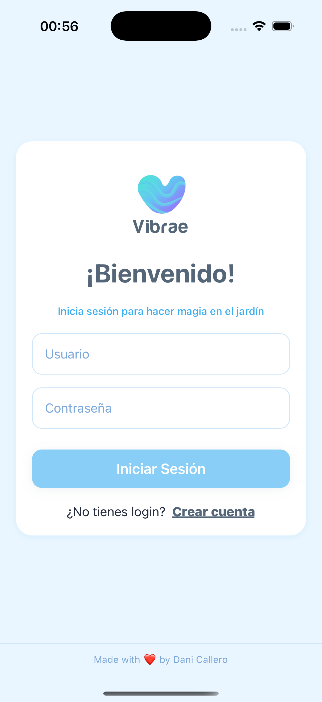
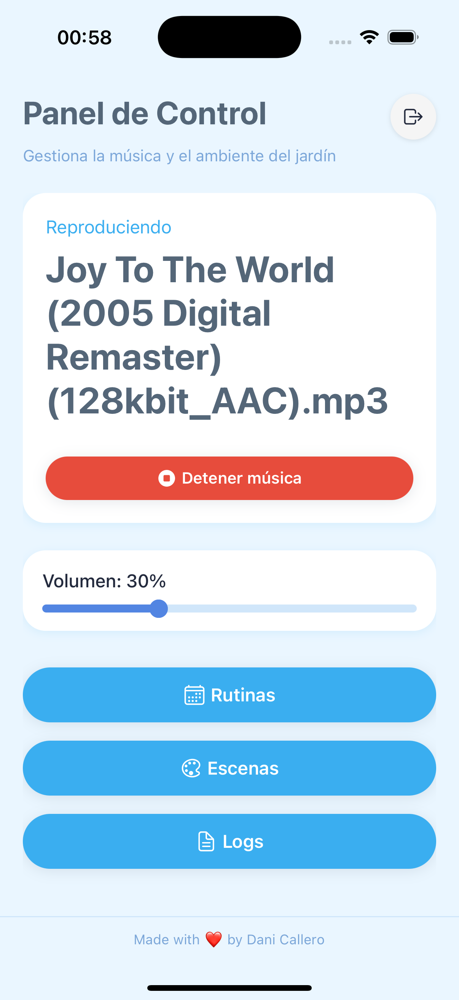
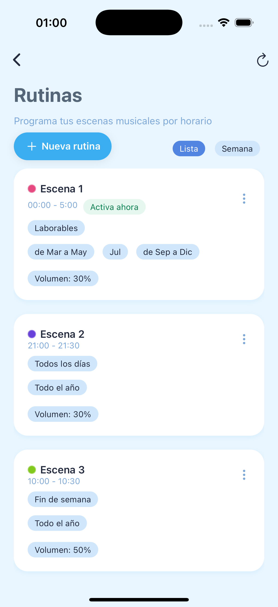
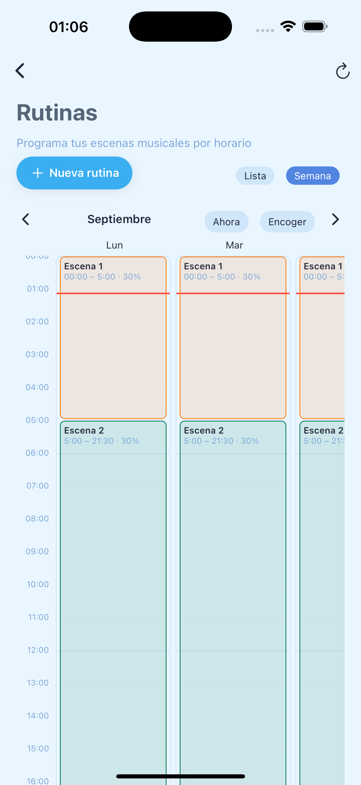
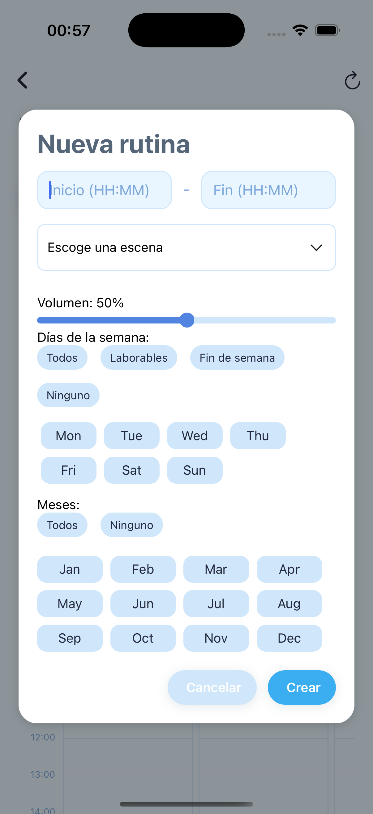
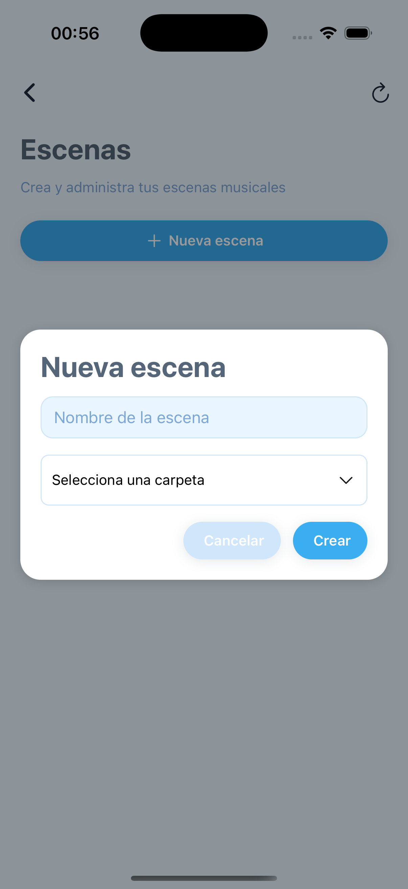

# Vibrae
<p align="center">
	
</p>
<div align="center">
	
	
	
	
	<a href="https://github.com/danicallero/vibrae/actions/workflows/ci.yml"></a>
	<a href="https://github.com/danicallero/vibrae/actions/workflows/codeql.yml"></a>
	<a href="https://github.com/danicallero/vibrae/actions/workflows/sbom.yml"></a>
</div>

---

## Table of Contents

1. [Overview](#overview)
2. [Features](#features)
3. [Folder Structure](#folder-structure)
4. [Quick Start](#quick-start)
5. [Deployment & Configuration](#deployment--configuration)
6. [Environment Variables](#environment-variables)
7. [Logs & Monitoring](#logs--monitoring)
8. [CLI Usage](#cli-usage)
9. [Testing](#testing)
10. [Screenshots](#screenshots)
11. [License](#license)

---

## Overview

**Vibrae** is a full-stack, open-source music automation system for gardens, patios, or any space where ambient music can enhance the experience. Designed for flexibility, customization, and ease of use, Vibrae enables fully self-hosted control—no external services or proprietary hardware required.

> **Why Vibrae?**
> Most music scheduling systems are basic, cloud-dependent, or tied to proprietary hardware. Vibrae is self-hosted, flexible, and fully controllable, running on Raspberry Pi, Mac, or Linux. Enjoy scheduled playlists, scenes, routines, volume control, and real-time updates from any device.

---

## Features

- Real-time music scheduling & playback
- Scene and routine management
- Mobile/PWA frontend (Expo, React Native)
- Easy deployment with unified scripts or Docker Compose
- Optional secure access via Tailscale VPN
- Reverse proxy via nginx (Cloudflare Tunnel or VPN handles HTTPS)
- Encrypted environment files (SOPS + PGP)
- Customizable playlists, scenes, schedules
- Control from any device
- Open-source, portable configuration

---

## Folder Structure

```text
apps/
  api/                      # FastAPI backend service
  web/                      # Expo React Native web/mobile app
packages/
  core/                     # Core domain logic (auth, db, player, scheduler)
config/
  env/
    .env.example            # Configuration template
    .env.backend            # Active config (created from template)
  logging.ini               # Logging configuration
scripts/
  app/                      # Deployment scripts (run, stop, setup)
  pi/                       # Raspberry Pi systemd integration
lib/
  cli-helpers.sh            # CLI utilities (colors, SOPS, helpers)
  env-manager.sh            # Environment management commands
music/                      # Your music library (folder per scene)
tests/                      # Test suite
docs/                       # Documentation and screenshots
  CLI_REFERENCE.md          # CLI command reference
  SIMPLIFICATION.md         # Architecture simplification summary
vibrae                      # Simple CLI (start, stop, config, logs)
pyproject.toml              # Dependencies and build config
Makefile                    # Development shortcuts
```

---

## Quick Start

```bash
# 1. Clone and setup
git clone https://github.com/danicallero/vibrae.git
cd vibrae
make install

# 2. Configure
./vibrae config
# Edit SECRET_KEY, DOMAIN, and other settings

# 3. Start services
./vibrae start

# 4. Check status
./vibrae status
```

That's it! Access your app at the configured domain or `http://localhost:8000`

---

## CLI Usage

The `vibrae` CLI provides simple commands to manage your installation:

```bash
# Essential commands
vibrae start           # Start all services
vibrae up              # Alias for start
vibrae stop            # Stop all services
vibrae down            # Alias for stop
vibrae restart         # Restart services
vibrae status          # Check what's running
vibrae st              # Alias for status

# Development
vibrae install         # Install dependencies
vibrae test            # Run tests
vibrae logs [service]  # View logs (backend, player, etc.)
vibrae config          # Edit configuration
vibrae db-init         # Initialize database

# Environment management
vibrae env init        # Create config from template
vibrae env edit        # Edit config file
vibrae env show        # Display current config
vibrae env encrypt     # Encrypt config (SOPS)
vibrae env decrypt     # Decrypt config (SOPS)
vibrae env edit-sec    # Edit encrypted config
vibrae env help        # Show env commands

# Info
vibrae help            # Show help
vibrae version         # Show version
vibrae -v              # Show version (short)
```

**Modular Architecture**: The CLI is split into focused modules:
- `vibrae` - Main entry point (155 lines)
- `lib/cli-helpers.sh` - Colors, utilities, SOPS (180 lines)
- `lib/env-manager.sh` - Environment management (205 lines)

See [CLI Reference](docs/CLI_REFERENCE.md) for detailed documentation.

---

## Build Web Frontend

From `apps/web/`, build the static export:

```bash
cd apps/web
npx expo export --platform web
```

The output goes to `apps/web/dist/` which the backend serves automatically.

---

## Deployment

### Development / macOS / Linux

```bash
./vibrae start    # Uses scripts/app/run.sh
```

### Raspberry Pi (Production with systemd)

```bash
sudo ./scripts/pi/setup.sh    # One-time setup
sudo systemctl start vibrae-*  # Start services
```

Or use: `./vibrae systemd install`

---

Services created (systemd):

- vibrae-backend.service (Uvicorn / FastAPI)
- vibrae-frontend.service (static server via `npx serve` if export exists)
- vibrae-cloudflared.service (optional; requires `CLOUDFLARE_TUNNEL_TOKEN`)
- vibrae-update.service + vibrae-update.timer (auto‑pull + reinstall every ~10min)

Common management:

```bash
./vibrae systemd status
./vibrae systemd start
./vibrae systemd stop
./vibrae systemd logs
# aliases: use `sys` or legacy `pi` in place of `systemd`
```

Passwordless sudo (optional):

To avoid re‑typing your password for service control, enable a limited sudoers rule during setup:

```bash
VIBRAE_SUDOERS=1 ./vibrae systemd install
```

This grants your user NOPASSWD for a small set of Vibrae commands: systemctl start/stop/restart/status vibrae-* and nginx; journalctl for vibrae-* and nginx; and the Pi helper scripts. Safe for operational convenience.

Alternatively, you can add these sudoers rules any time after installation without reinstalling:

```bash
./vibrae systemd sudoers   # aliases: sys sudoers, pi sudoers
```

Notes:

- The canonical setup script lives at `scripts/pi/setup.sh`. The legacy `raspi/setup.sh` remains as a thin wrapper (deprecated).
- The installer will decrypt `config/env/.env.backend.enc` if present and keys are available. By default, `.sops.yaml` uses PGP; AGE works only if you add `age` recipients and re‑encrypt. Plaintext is written to `config/env/.env.backend` on the Pi.
- Auto‑update is idempotent and non‑interactive. It will attempt `git pull` (or hard reset) and reinstall Python deps if needed, then restart services.

Adding AGE recipients (optional):

1) Generate an age key on your workstation (keeps private key local):
```bash
age-keygen -o ~/.config/age/key.txt
```
2) Copy the public recipient (starts with `age1...`) from that file and add to `.sops.yaml` under `key_groups.age`:
```yaml
creation_rules:
	- path_regex: '^config/env/\\.env\\.(backend|frontend)(\\.enc)?$'
		key_groups:
			- pgp:
					- FF46BCFF59A65BC21DA916A289FC9A82DD3ECF94  # dani's macbook
				age:
					- age1yourpublicrecipient...
```
3) Re-encrypt your envs so they include an age stanza:
```bash
./vibrae env encrypt
./vibrae env f-encrypt
```

---

## Environment Variables

All configuration is managed through `config/env/.env.backend` (or `.env` for backwards compatibility).

Use `config/env/.env.example` as a template:

```bash
cp config/env/.env.example config/env/.env.backend
# Edit and customize your settings
```

### Configuration Keys

| Key | Purpose | Default |
|-----|---------|---------|
| **Backend** | | |
| BACKEND_PORT | API listen port | 8000 |
| BACKEND_MODULE | Uvicorn module path | apps.api.src.vibrae_api.main:app |
| SECRET_KEY | JWT signing secret | change-me-please |
| **Frontend** | | |
| FRONTEND_PORT | Static server port | 9081 |
| FRONTEND_DIST | Web build path | /apps/web/dist |
| **Music** | | |
| MUSIC_MODE | Source type: folder or usb | folder |
| MUSIC_DIR | Music directory path | music |
| USB_SUBDIR | USB subdirectory (if usb mode) | |
| VIBRAE_MUSIC | USB mount point | |
| **Logging** | | |
| LOG_LEVEL | Log verbosity | INFO |
| LOG_KEEP | Rotated logs to keep | 5 |
| LOG_ROTATE_INTERVAL_HOURS | Rotation interval | 12 |
| **Networking** | | |
| DOMAIN | Public domain | |
| NGINX_CONF | Nginx config file | nginx.conf |
| TUNNEL | Tunnel mode: cloudflared/none | cloudflared |
| CLOUDFLARE_TUNNEL_TOKEN | Cloudflare token | |
| **Other** | | |
| AUTOSTART | Auto-start on CLI launch | false |

### Secret Management

For production deployments, you can encrypt sensitive values using SOPS:

```bash
# Encrypt configuration
./vibrae env encrypt

# Edit encrypted config
./vibrae env edit-sec
```

Encrypted files (`.env.*.enc`) can be safely committed to git.

Commands now RETAIN plaintext after encrypt / edit cycles (no auto shred). This supports iterative local edits without repeated decrypt steps. You must manually ensure you do not commit plaintext files (gitignore already blocks them).

Legacy names still warn: `.env.runtime*`, `.env.frontend.runtime*`.

#### One‑time PGP setup
Import the provided public keys (each machine):
```bash
gpg --import path/to/public_key_1.asc
gpg --import path/to/public_key_2.asc
```
Confirm fingerprints match those in `.sops.yaml`.

#### Migrating old runtime files
If you still have legacy `*.runtime*` or root `.env` files, manually copy relevant keys into `config/env/.env.backend` / `.env.frontend` then remove the legacy files. The CLI will warn if it detects them.

#### Backend secret workflow
```bash
./vibrae env sync         # create or fill gaps in .env.backend
./vibrae env edit         # set required values (SECRET_KEY, DOMAIN, etc.)
./vibrae env encrypt      # produce .env.backend.enc (plaintext kept locally)
./vibrae env edit-sec     # safe cycle: decrypt -> edit -> re-encrypt (plaintext retained)
```
Plaintext is intentionally retained for iterative development; never commit it.

#### Frontend secret/public workflow
```bash
./vibrae env f-sync       # ensure .env.frontend exists
./vibrae env f-edit       # add EXPO_PUBLIC_* vars
./vibrae env f-encrypt    # produce .env.frontend.enc
./vibrae env f-edit-sec   # safe edit cycle (decrypt -> edit -> encrypt)
```

#### Decrypt (materialize / refresh plaintext)
```bash
./vibrae env decrypt      # backend
./vibrae env f-decrypt    # frontend
```

If plaintext already exists it will just be overwritten with current decrypted content.

#### Safety / CI notes
- Never commit plaintext `config/env/.env.*` files (gitignore blocks them; verify before pushing).
- Commit: `.env.*.example` + `.env.*.enc` only.
- CI/CD: import GPG private key(s), run decrypt to materialize working plaintext before invoking `run.sh` / tests.
- Optional hygiene step (manual): `shred -u config/env/.env.backend config/env/.env.frontend 2>/dev/null || rm -f ...` BEFORE screen sharing or support dumps.

Future enhancement (planned): `vibrae env scrub` to securely remove any plaintext envs prior to publishing artifacts.

#### run.sh sourcing summary
Order: `.env.backend` (warn & fallback: legacy `.env.runtime*`) → `.env.frontend` → shell exports. Root `.env` is ignored (warning printed if present).

---

## Health Checks

Check service health at:

```
GET /health
```

Returns JSON:

```
{
	"backend": "ok",
	"frontend": "ok" | "missing",
	"player": "ok" | "idle"
}
```

## Logs & Monitoring

Logs under `logs/` with history in `logs/history/`:

| File | Purpose |
|------|---------|
| backend.log | API + uvicorn + general app messages |
| player.log  | Player & scheduler events (separate handler) |
| serve.log   | Static server (npx serve) output |
| cloudflared.log | Tunnel connection logs |

Rotation:
- Copy-truncate; configurable via `LOG_KEEP` & `LOG_ROTATE_INTERVAL_HOURS`.
- History naming: `<name>-YYYYMMDD-HHMMSS.log`.

Frontend Logs UI:
- Browse latest and historical files.
- Tail with adjustable line count.
- Jump between history snapshots quickly.


## CLI Usage

Grouped summary (see `vibrae help` or any `command -h` for detailed help):

Core: `start`, `stop`, `restart`, `status`, `logs`, `open`, `url`, `front restart`
Environment: `env show|edit|set|get|sync|encrypt|decrypt|edit-sec` + frontend `f-show|f-edit|f-set|f-get|f-sync|f-encrypt|f-decrypt|f-edit-sec`
Database: `db init` (maps internally to `db-init`)
Music Source: `source detect`, `autostart on|off`
Diagnostics: `check-env`, `doctor`
Systemd (Linux): `systemd install|start|stop|status|logs|sudoers` (aliases: `sys`, `pi`)
macOS: `mac sudoers`
Misc: `shell`, `clear`, `version`, `help`

Inside interactive shell: `help`, `status`, `logs`, etc. AUTOSTART (if true) triggers service start upon entering shell.

### Quick Cheat Sheet

| Task | Command |
|------|---------|
| Install deps / venv | `vibrae install` |
| Start / Stop / Restart | `vibrae start` / `vibrae stop` / `vibrae restart` |
| Show status & health | `vibrae status` |
| Tail logs (all / one) | `vibrae logs` / `vibrae logs backend 200` |
| Open web UI | `vibrae open` |
| Print URLs | `vibrae url` |
| Sync missing env keys | `vibrae env sync` |
| Show / edit backend env | `vibrae env show` / `vibrae env edit` |
| Set one key | `vibrae env set KEY=VALUE` |
| Encrypt backend / frontend | `vibrae env encrypt` / `vibrae env f-encrypt` |
| Secure edit backend / frontend | `vibrae env edit-sec` / `vibrae env f-edit-sec` |
| Decrypt (materialize/update) | `vibrae env decrypt` / `vibrae env f-decrypt` |
| Frontend show / edit | `vibrae env f-show` / `vibrae env f-edit` |
| Frontend set one key | `vibrae env f-set KEY=VALUE` |
| Frontend sync defaults | `vibrae env f-sync` |
| Show single backend key | `vibrae env get KEY` |
| Show single frontend key | `vibrae env f-get KEY` |
| Detect music source | `vibrae source detect` |
| Toggle autostart | `vibrae autostart on|off` |
| Add Linux passwordless sudo (systemd) | `vibrae systemd sudoers` (or `VIBRAE_SUDOERS=1 vibrae systemd install`) |
| Add macOS passwordless sudo | `vibrae mac sudoers` |
| Initialize database | `vibrae db init` |
| Environment validation | `vibrae check-env` (alias: `ce`) |
| Dependency doctor | `vibrae doctor` (alias: `doc`) |
| Systemd service logs | `vibrae systemd logs` (aliases: `sys logs`, `pi logs`) |
| Interactive shell | `vibrae shell` (alias: `sh`) |

Aliases: `ver`→version, `st`→status, `ce`→check-env, `doc`→doctor, `up`→start, `down`→stop, `ls-env`→env show.

### Typical First Run Flow
```bash
vibrae install
vibrae env sync          # ensure backend file & defaults
vibrae env f-sync        # ensure frontend defaults
vibrae env edit          # set SECRET_KEY, DOMAIN, etc.
vibrae env encrypt       # create backend encrypted blob (optional early)
vibrae env f-encrypt     # create frontend encrypted blob (optional)
vibrae db init           # create tables / seed admin
vibrae start             # launch stack
vibrae status            # confirm health
```

### Secure Edit vs Plain Edit
`env edit` edits existing plaintext directly (fails if missing). `env edit-sec` always performs decrypt → edit → re-encrypt, ensuring `.enc` stays current. Both now keep plaintext; use `git status` before committing.

### PGP Key Management (SOPS)
` .sops.yaml` lists recipient fingerprints. To grant a new collaborator access:
1. Add their public key (they send you: `gpg --armor --export <FPR>`).
2. Append their fingerprint under the appropriate SOPS `pgp` recipients in `.sops.yaml`.
3. Re-encrypt each env: `vibrae env encrypt && vibrae env f-encrypt`.
4. Commit updated `.sops.yaml` + `*.enc`.

Rotate / revoke access (lost key or teammate leaves):
1. Remove old fingerprint from `.sops.yaml`.
2. Import replacement/new key(s).
3. Re-encrypt both backend & frontend envs.
4. Commit new encrypted blobs.

List local keys:
```bash
gpg --list-keys
```
Show fingerprints only:
```bash
gpg --list-keys --fingerprint | grep -E '^[ ]+[0-9A-F]{40}$'
```

Test decryption without writing plaintext:
```bash
sops --decrypt config/env/.env.backend.enc >/dev/null
```

### Adding a New Secret / Key
Backend (plaintext present):
```bash
vibrae env set NEW_KEY=value
vibrae env encrypt        # keep encrypted blob in sync
```
Frontend:
```bash
vibrae env f-set EXPO_PUBLIC_FEATURE_FLAG=1
vibrae env f-encrypt
```

### CI/CD Secrets Flow Example
Pseudo GitHub Actions step (conceptual):
```yaml
- name: Import GPG private key
	run: |
		echo "$GPG_PRIVATE_KEY" | gpg --batch --import
		echo "$GPG_OWNERTRUST" | gpg --batch --import-ownertrust || true
- name: Decrypt env
	run: |
		./vibrae env decrypt
		./vibrae env f-decrypt || true
- name: Start services (test mode)
	run: |
		vibrae db init
		vibrae start
		# run integration tests here
```

If you want to avoid persisting plaintext post‑pipeline, delete them at end:
```bash
rm -f config/env/.env.backend config/env/.env.frontend
```

### Command Help Flags
Every top‑level command and subcommand accepts `-h` / `--help` (e.g. `vibrae env -h`, `vibrae front restart -h`).

## Testing

### Overview
Automated tests now cover core subsystems:

| Area | File(s) | Focus |
|------|---------|-------|
| Player crossfade | `tests/test_player_crossfade.py` | Crossfade loop, guard window, graceful stop |
| Config resolution | `tests/test_config_paths.py` | Repo root heuristic, music & web dist fallback |
| DB init | `tests/test_db_init.py` | Idempotent table creation + optional admin seed path |
| Auth | `tests/test_auth_token.py` | Token encode/decode + password hashing/verify |
| Scheduler matching | `tests/test_scheduler_match.py` | Routine + scene time-window match logic |
| CLI surface | `tests/test_cli_version.py` | Basic invocation & version output |

These run fast and rely only on an in-repo SQLite file plus standard libs. VLC functions are mocked so no real audio output occurs.

Optional dependencies:
* If `passlib` isn't installed, auth tests fall back to a lightweight PBKDF2‑HMAC(SHA‑256) hasher with a static salt for deterministic runs, configurable via env. This preserves round‑trip verification in minimal environments.
* If `python-vlc` isn't available, the test fixture supplies a mock module; scheduler tests will skip only if even the mock can't be initialized.

### Run Tests
From the project root (example fresh environment):

```bash
python -m venv .venv
source .venv/bin/activate
pip install -e .[dev]
pytest -q
```

Selective runs:
```bash
pytest tests/test_config_paths.py::test_effective_web_dist_fallback -q
pytest -k scheduler -q
```

Show slowest 10 tests:
```bash
pytest --durations=10 -q
```

### VLC Mock Design
- Defined in `tests/conftest.py` as an autouse fixture `mock_vlc`.
- Replaces the real `vlc` module before `vibrae_core.player` is imported.
- Media duration is short (a few seconds) so crossfades complete quickly.
- Player state is exercised via the real playback thread; only the media/volume/time functions are simulated.

### Adding More Tests
Guidelines:
1. Keep individual tests < 1s wall time (use `wait_until` helper vs. long sleeps).
2. Use temporary paths (`tmp_path` fixture) when writing files.
3. Avoid network calls; mock external processes (tunnels, nginx) if/when added.
4. Prefer pure functions or thin wrappers for new logic to simplify assertions.
5. Mark integration/slow tests with `@pytest.mark.slow` (none currently) so they can be excluded: `pytest -m 'not slow'`.

Player module note: use the `player_module` fixture (see `tests/conftest.py`) which ensures the VLC mock is loaded before importing the real player code.

### Customizing Mock Behavior
Adjust or extend the VLC mock in `tests/conftest.py`:
* Change `MockMedia.get_duration()` duration for different crossfade scenarios.
* Add attributes/events to verify intermediate playback states.

### Using Real VLC (Optional)
If you want an integration run with real audio:
1. Temporarily comment out or rename the `mock_vlc` autouse fixture in `tests/conftest.py`.
2. Ensure local VLC runtime / `python-vlc` is installed.
3. Provide actual media files under `music/`.

Keep such runs separate; unit tests should remain fast and silent by default.

---

## Screenshots

Click any thumbnail to view the full-size image.

|  |  |  |
|:--:|:--:|:--:|
| <a href="docs/screenshots/login.png"></a><br/><sub>Login</sub> | <a href="docs/screenshots/home.png"></a><br/><sub>Home</sub> | <a href="docs/screenshots/routine_list_view.png"></a><br/><sub>Routine List View</sub> |
| <a href="docs/screenshots/routine_week_view.png"></a><br/><sub>Routine Week View</sub> | <a href="docs/screenshots/routine_creation.png"></a><br/><sub>Routine Creation</sub> | <a href="docs/screenshots/routine_edit.png"></a><br/><sub>Routine Edit</sub> |
| &nbsp; | <a href="docs/screenshots/scene_creation.png"></a><br/><sub>Scene Creation</sub> | &nbsp; |

---

## Documentation

Comprehensive guides are available in the `docs/` directory:

- **[CLI Reference](docs/CLI_REFERENCE.md)** - Complete CLI command reference with examples
- **[Simplification Summary](docs/SIMPLIFICATION.md)** - Architecture changes and improvements
- **Testing** - See the [Testing](#testing) section above

The CLI has been streamlined from 1323 lines to 540 lines (59% reduction) while maintaining all functionality through modular design. See the [Simplification Summary](docs/SIMPLIFICATION.md) for details.

---

## License

This project is licensed under the GNU GPLv3. See `LICENSE` for full terms.

<div align="center">
Made with ❤️, Python, React Native, and Expo by <b>Dani Callero</b>
</div>

---